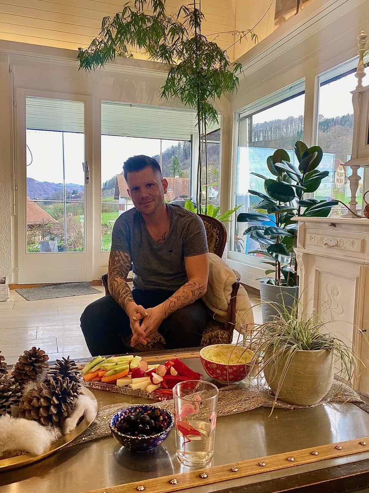

+++
title = "Wenn man dieses unwohle Gefühl endlich loswird, -oder nicht?"
date = "2024-05-04"
draft = false
pinned = false
image = "img_0997-3-.jpg"
description = "Ein Besuch im Alltag einer Transgenderperson"
+++
*Lina lu Reichenwallner*

Ein Besuch im Alltag einer Transgenderperson

Für viele Menschen ist es selbstverständlich, dass sie sich mit dem Geschlecht identifizieren, welches ihnen bei der Geburt zugewiesen wurde. Doch für Transgender-Menschen ist dies nicht der Fall. Sie fühlen sich dem anderen Geschlecht zugehörig oder empfinden sich weder als Mann noch als Frau.

Tim, ein 35-jähriger Transmann aus Kehrsatz, hat diesen Weg bereits hinter sich. An einem warmen Tag treffe ich Tim, der mit seiner Frau zusammenlebt, in ihrem gemeinsamen Haus in Kehrsatz. Ich werde herzlich von ihnen und zwei kleinen Hunden empfangen. Das Haus ist angenehm warm gestaltet und ein Apero wartet auf mich. Ich setze mich neben den vielen Grünpflanzen auf die Couch und zu füssen liegen mir die sanft schnarchenden Hündlein. Tim setzt sich in einen antiken Sessel und überschlägt seine Beine.  Im Gespräch erzählt er von seinen Erfahrungen und gibt Einblicke in die Herausforderungen und Freuden, die mit einer Transition verbunden sind.

Für Tim war schon in der Kindheit klar, dass er sich als Junge fühlte, auch wenn er biologisch als Mädchen geboren wurde. "Ich bin schon immer lieber mit den Jungs zusammen gewesen und hatte Mühe, als mir Brüste gewachsen sind", erinnert er sich. Lange Zeit drängte er diese Gefühle jedoch zurück und versuchte, die "klassische" Rolle der Frau zu erfüllen. Erst mit 21 Jahren, während eines Auslandsaufenthalts in San Francisco, begann sich Tim intensiver mit dem Thema auseinanderzusetzen. Doch es dauerte noch weitere 10 Jahre, bis er den Schritt wagte, sein äußeres Erscheinungsbild an seine innere Identität anzupassen. "Wahrscheinlich dauert es ein ganzes Leben", reflektiert Tim.

 

> *Der Begriff „Transvestiten“ wurde 1910 vom Sexualforscher Magnus Hirschfeld eingeführt. 1930 wurde in einer Dresdner Frauenklinik eine der ersten Geschlechtangleichungen durchgeführt. Leider verstarb die Patientin rund ein Jahr danach. In der Folge fanden eine Vielzahl an Experimenten und Forschungen statt. Ab den 1950er Jahren wurde ,,Transsexualität‘‘ von der Medizin und Psychologie als Krankheit definiert und schliesslich als solche in der internationalen Klassifikation von Krankheiten (ICD) gelistet.*
>
> *Erst in den letzten Jahren hat ein Umdenken stattgefunden. 2018 entfernte die Weltgesundheitsorganisation (WHO) Geschlechtsinkongruenz aus der Liste der psychischen Erkrankungen und stufte sie stattdessen als Variante der Geschlechtsidentität ein. Auch in den Medien und der Popkultur sind Transgender-Personen heute präsenter denn je - von Laverne Cox in der Serie "Orange Is the New Black" bis hin zu der TV- Persönlichkeit Caitlyn Jenner.*

 

**„Man darf uns alles fragen!“**

Für viele Transgender-Menschen ist der Weg zur Selbstfindung und Akzeptanz ein langer und herausfordernder Prozess, bei dem sie sich oft gegen Vorurteile und Unverständnis in ihrem Umfeld behaupten müssen. Dennoch betont Tim, dass die meisten Transgender-Menschen durchaus offen für Fragen sind und es ihnen lieber ist, direkt angesprochen zu werden, als dass sich hinter ihrem Rücken eine Meinung über sie gebildet wird. Tim plädiert auch in Bezug auf Pronomen und genderneutrale Sprache für Verständnis auf beiden Seiten. Auch für ihn, obwohl er sich aktiv in der LGBTQ- Community bewege, sei dies nicht immer einfach. So müsse auch er sich, beispielweise bei Verfassen einer E-Mail, oft überlegen, wie er einen Satz am besten formuliere, ohne dabei jemanden persönlich anzugreifen.  Er wünscht sich ein "Geben und Nehmen", bei dem niemand unter Druck gerät.

Trotz der Herausforderungen überwiegen für Tim die positiven Aspekte seiner Geschlechtsumwandlung. "Ich gehe schon mit einem ganz anderen Gefühl auf Menschen zu", sagt er. Auch in Beziehungen habe sich einiges verändert - zum Guten. "Die Meisten haben es vielleicht auch schon ein bisschen vermutet, daher haben sie sehr gut reagiert."

Tim erklärt, dass sich das Outing als Transgender-Person fast ausnahmslos positiv auf Freundschaften und Beziehungen auswirkte. Durch die Möglichkeit, endlich zu sich selbst zu stehen, können Transgender-Personen offener und selbstbewusster auf andere Menschen zugehen. Auch wenn jeder Mensch seinen individuellen Weg gehen muss, zeigt Tims Geschichte, dass es möglich ist, zu sich selbst zu finden und ein erfülltes Leben zu führen - unabhängig von gesellschaftlichen Rollenbildern. Mit sich selber zufrieden zu sein, ist am wichtigsten, meint Tim. „Wenn man genug Selbstvertrauen hat, braucht man die Bestätigung von außen nicht."

Für andere Transgender-Menschen, die gerade ihren Weg suchen, hat Tim einen wichtigen Rat: "Man sollte ausprobieren, sich zeigen, dazu stehen was man ist und sich vor allem auch mit anderen austauschen, die den Weg bereits gegangen sind." Anlaufstellen wie die Transgender Network Switzerland (TGNS) können dabei Unterstützung bieten.

 

**Schattenseiten**

Doch die Transgender-Community ist nach wie vor mit Vorurteilen und Missverständnissen konfrontiert. Viele Transgender-Menschen erleben Diskriminierung, Ausgrenzung und Gewalt. Besonders betroffen sind junge Transpersonen, die oft mit Unverständnis und Ablehnung in ihrem Umfeld konfrontiert sind. Um mehr Akzeptanz und Verständnis zu schaffen, sei es wichtig, den direkten Kontakt zu suchen und offen für Fragen zu sein. „Mit einem direkten Kontakt würde man merken, dass wir wie alle anderen Menschen sind.“ Umso wichtiger sind Aufklärung, Sichtbarkeit und Solidarität. Initiativen wie das TGNS setzen sich für die Rechte und Anliegen von Transgender-Personen ein. Und auch in der Wissenschaft rückt das Thema zunehmend in den Fokus - von Studien zur Lebenssituation bis hin zu medizinischen Leitlinien.

Letztlich geht es darum, die Vielfalt menschlicher Identitäten und Erfahrungen anzuerkennen und zu respektieren.  Nur so können wir eine Gesellschaft schaffen, in der sich alle Menschen frei und selbstbestimmt entfalten und bewegen können - unabhängig von Geschlechternormen und-Zuschreibungen. Der Weg dahin ist lang, aber die Geschichte zeigt: Transgender-Personen haben schon immer gelebt und gekämpft. Und sie werden auch in Zukunft sichtbar und stolz ihre Identität leben.